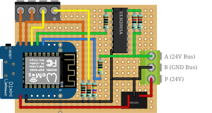

# ESPHome doorman s3 using custom board
My own version using doorman s3 software and board based on [this](https://github.com/peteh/doorman#wiring).

## Features
- Unlock entrance door
- Dectect indoor station using serialnumber
- Homeassistant event entities
- Ring-to-open and unlock through pattern.
- Silence doorbell
- Volume control for handset and doorbell

## Board
Based on this picture. I am not using button or led, only the basic to connect it to the bus.

### Parts
- 1x ESP-WROOM-32
- 1x ULN2003A (to send commands to the bus) Buy on Amazon
- 2x double screw terminal
- 1x 1 MOhm resistor
- 1x 1 kOhm resistor
- 1x 147 kOhm
- 2x 1.2 Ohm resistors

I am powering it with at 230v to 5v power supply.

## Pictures

 

## Credit goes to:

**[Doorman-s3](https://github.com/AzonInc/Doorman)**\
Project uses doorman s3 firmware parts.

**[Doorman](https://github.com/peteh/doorman)**\
Wiring is based on the original doorman project.
